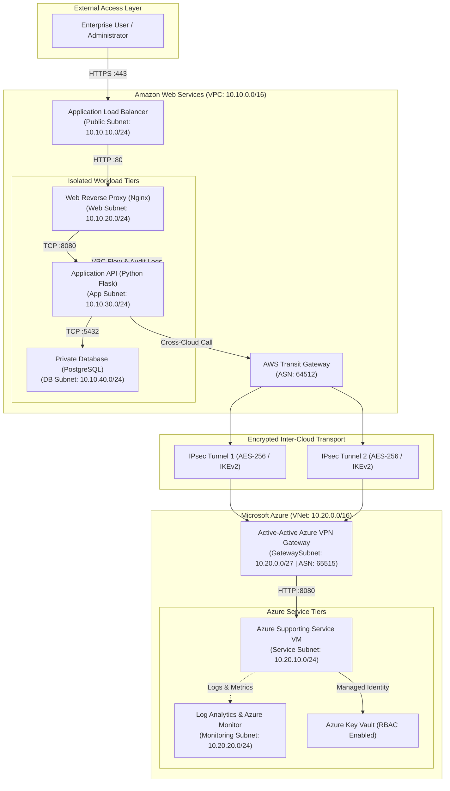
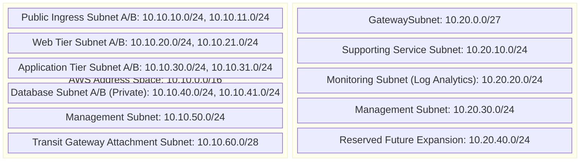
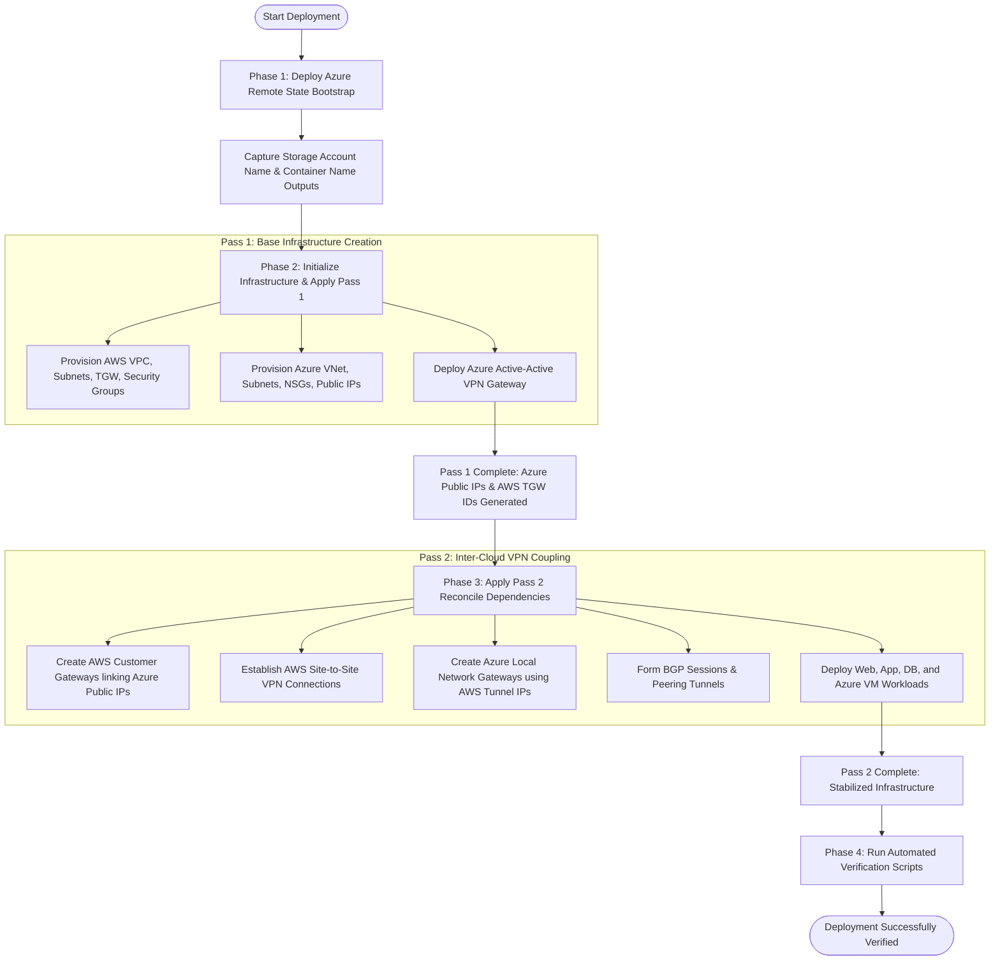
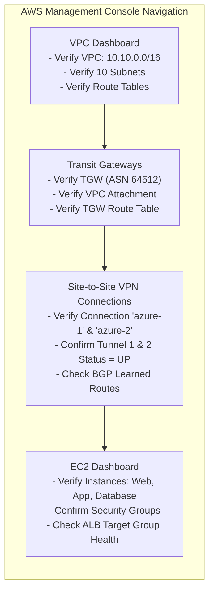
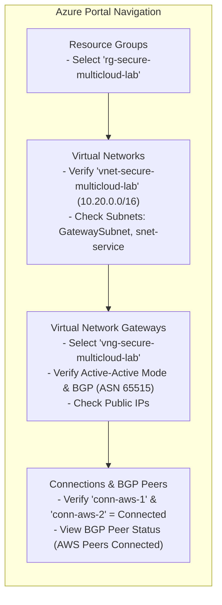
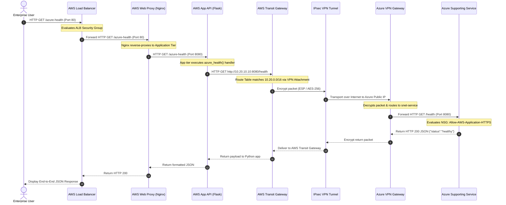
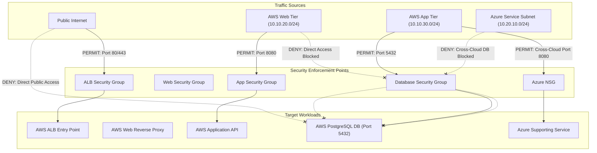
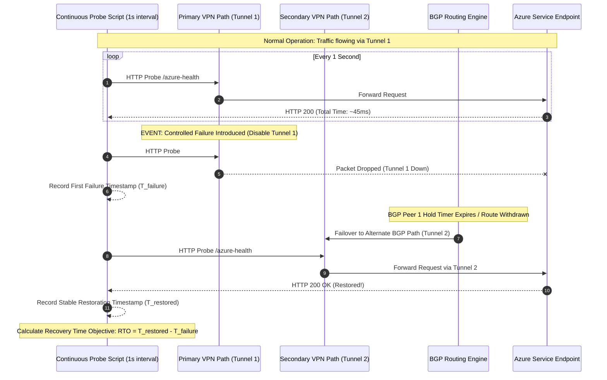

# Visual Setup Guide: AWS–Azure Multi-Cloud Architecture

This guide provides a comprehensive **visual walkthrough** featuring interactive diagrams, system topology maps, multi-stage deployment flowcharts, and component interaction sequence diagrams for establishing the secure **AWS–Azure Multi-Cloud Architecture**.

---

## 1. End-to-End System Architecture

The overall multi-cloud deployment spans **AWS** (Region: `us-east-1`) and **Microsoft Azure** (Region: `eastus`), connected via an encrypted IPsec BGP VPN tunnel:

---

## 2. Visual Address Space & Subnet Allocation Map

---

## 3. Visual Deployment Pipeline (Staged Terraform Flow)

Because Azure VPN Gateway addresses must exist before AWS Customer Gateways can be created, and AWS dynamic tunnel addresses must be retrieved before Azure Local Gateways are finalized, the deployment uses a **staged 2-pass execution pipeline**:

---

## 4. Visual AWS Console Setup Walkthrough

Below is the step-by-step visual map for navigating the **AWS Management Console** to verify created resources:

---

## 5. Visual Azure Portal Setup Walkthrough

Below is the step-by-step visual map for navigating the **Azure Portal** (`portal.azure.com`) to verify created resources:

---

## 6. End-to-End Cross-Cloud Request Sequence

This sequence diagram illustrates the step-by-step packet flow when a user initiates a cross-cloud application request (`curl http://<AWS-ALB-DNS>/azure-health`):

---

## 7. Zero Trust Access Enforcement Matrix (Allowed vs Blocked)

---

## 8. Automated Failover & Resilience Sequence (RTO Measurement)

